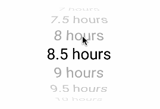
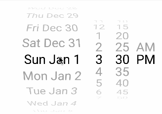

# ReactNativeWheelPicker
[](https://npmjs.org/package/react-native-wheel-picker-android "View this project on npm")
[](https://npmjs.org/package/react-native-wheel-picker-android "View this project on npm")

A simple Wheel Picker for Android based on https://github.com/AigeStudio/WheelPicker
Also you can use multiple pickers, such as DatePicker or TimePicker

For IOS you can use a [good Picker for IOS](https://facebook.github.io/react-native/docs/pickerios.html)
and [DatePicker for IOS](https://facebook.github.io/react-native/docs/datepickerios.html)

## Installation Android
`yarn add react-native-wheel-picker-android`
`react-native link react-native-wheel-picker-android`

# Usage

```js

import { WheelPicker, DatePicker, TimePicker } from 'react-native-wheel-picker-android'
import React, { Component } from 'react';
import {
  AppRegistry,
  StyleSheet,
  Text,
  View
} from 'react-native';

const wheelPickerData = ['Sunday', 'Monday', 'Tuesday', 'Wednesday', 'Thursday', 'Friday','Saturday'];
const now = new Date()

class MyPickers extends Component {
  render() {
    return (
      <View style={styles.container}>
        <WheelPicker
           onItemSelected={(event)=>this.onItemSelected(event)}
           isCurved
           data={wheelPickerData}
           style={styles.wheelPicker}/>
         <DatePicker
           initDate={now.toISOString()}
           onDateSelected={(date)=>this.onDateSelected(date)}/>
         <TimePicker
           initDate={now.toISOString()}
           onTimeSelected={(date)=>this.onTimeSelected(date)}/>
      </View>
    );
  }

  onItemSelected(event){
    // do something
  }

  onDateSelected(date){
    // do something
  }

  onTimeSelected(date){
    // do something
  }


}

const styles = StyleSheet.create({
  container: {
    flex: 1,
    alignItems: 'center',
  },
  wheelPicker: {
    width: 200,
    height: 150
  }
});

module.exports = MyPickers;

```

## Wheel Picker



```js

import { WheelPicker, DatePicker, TimePicker } from 'react-native-wheel-picker-android'
...

  render() {
    let arr = [1,2,3];
    return (
      <WheelPicker
          onItemSelected={(event)=>{/* do something */}}
          isCurved
          isCyclic
          data={arr}
          style={{width:300, height: 300}}/>
    );
  }
```

## Props

| Prop  | Default  | Type | Description |
| :------------ |:---------------:| :---------------:| :-----|
| onItemSelected | null | `func` | Callback when user select item {data: 'itemData', position: 'itemPosition'} |
| data | default string array | `array` | Data array (string or number type)  |
| isCurved | false | `bool` | Make Wheel Picker curved |
| isCyclic | false | `bool` | Make Wheel Picker cyclic |
| isAtmospheric | false | `bool` | Design Wheel Picker's items  |
| selectedItemTextColor | grey | `string` | Wheel Picker's selected Item Text Color  |
| itemSpace | 20 | `number` | Wheel Picker's items spacing |
| visibleItemCount | 7 | `number` | Wheel Picker's items max visible count  |
| renderIndicator | false | `bool` | Show Wheel Picker indicator |
| indicatorColor | transparent | `string` | Indicator color  |
| isCurtain | false | `bool` | Wheel Picker curtain  |
| curtainColor | transparent | `string` | Wheel Picker curtain color  |
| itemTextColor | grey | `string` | Wheel Picker's items color  |
| itemTextSize | 20 | `number` |  Wheel Picker's items text size  |
| itemTextFontFamily | null | `string` | Wheel Picker's items text font name  |
| selectedItemPosition | null | `number` | Select current item position |
| backgroundColor | transparent | `string` | Wheel Picker background color  |

### data

An array of options. This should be provided with an __array of strings__ or __array of numbers__.


### onItemSelected(event)

Callback with event in the form `event = { data: 1, position: 0 }`


## Time Picker


```js

...

  render() {
    const minutesArray = ['00', '15', '30', '45'];
    const now = new Date();
    return (
      	<TimePicker
	       minutes={minutesArray}
   	     onTimeSelected={(date)=>this.onTimeSelected(date))}
	       initDate={now.toISOString()}/>
    );
  }

  onTimeSelected(date){
    // do something
  }

```

## Props

| Prop  | Default  | Type | Description |
| :------------ |:---------------:| :---------------:| :-----|
| onTimeSelected | null | `func` | Callback when user select time {date: 'selectedTime'} |
| initDate | current date | `ISOString` | Initial selected time  |
| hours | [1, 2, 3, .. 12] | `array` | hours array |
| minutes | ['00', '05' ,'10', .. '55'] | `array` | minutes array |


## Date Picker



```js

...

  render() {
  let now = new Date();
    return (
      	<DatePicker
          initDate={now.toISOString()}
          onDateSelected={(date)=> this.onDateSelected(date)}/>
    );
  }

  onDateSelected(date){
    // do something
  }

```

## Props

| Prop  | Default  | Type | Description |
| :------------ |:---------------:| :---------------:| :-----|
| onDateSelected | null | `func` | Callback when user select date {date: 'selectedDate'} |
| initDate | current date | `ISOString` | Initial selected date  |
| days | ['Today', 'Wed Dec 28', ...] | `array` | days array |
| hours | [1, 2, 3 .. 12] | `array` | hours array |
| minutes | ['00', '05', '10', .. '55'] | `array` | minutes array |
| format24 | false | `bool` | if true hours format is 24 hours|
| startDate | current date | `ISOString` | The Earlest date |
| daysCount | 365 | `number` | How many days included in Date Picker |

## Questions or suggestions?

Feel free to [open an issue](https://github.com/ElekenAgency/ReactNativeWheelPicker/issues)
