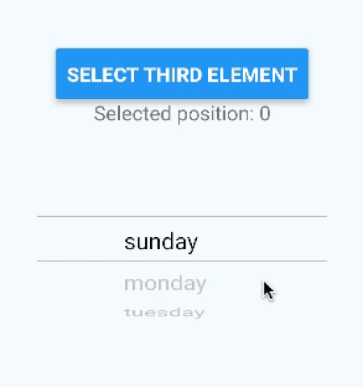
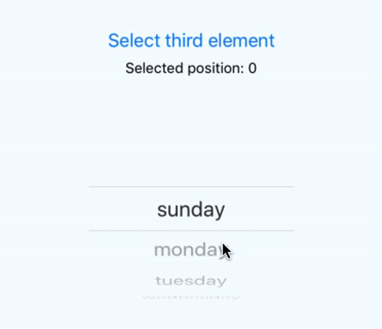
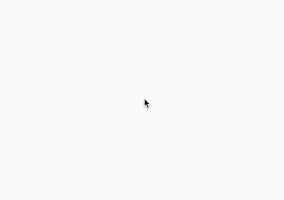
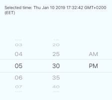
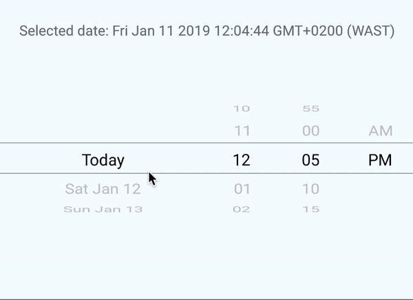

# React native wheel picker V2

<p>


</p>

A simple Wheel Picker for Android (For IOs is used PickerIOS)

## Installation

`yarn add react-native-wheel-picker-android`




## Automatic Installation

`react-native link react-native-wheel-picker-android`

## Manual Android Installation

In `android/settings.gradle`

```
include ':react-native-wheel-picker-android'
project(':react-native-wheel-picker-android').projectDir = new File(rootProject.projectDir, '../node_modules/react-native-wheel-picker-android/android')
```

In `android/app/build.gradle`

```
dependencies {
    ...
    compile project(':react-native-wheel-picker-android')
}
```

In `android/app/src/main/java/com/PROJECT_NAME/MainApplication.java`

```
@Override
protected List<ReactPackage> getPackages() {
  return Arrays.<ReactPackage>asList(new MainReactPackage(), new WheelPickerPackage());
}
```

# Usage

```js
import {
  WheelPicker,
  TimePicker,
  DatePicker
} from "react-native-wheel-picker-android";
import React, { Component } from "react";
import { AppRegistry, StyleSheet, Text, View, Button } from "react-native";

const wheelPickerData = [
  "sunday",
  "monday",
  "tuesday",
  "wednesday",
  "thursday",
  "friday"
];

class MyPicker extends Component {
  state = {
    selectedItem: 0
  };

  onItemSelected = selectedItem => {
    this.setState({ selectedItem });
  };

  onPress = () => {
    this.setState({ selectedItem: 3 });
  };

  render() {
    return (
      <View style={styles.container}>
        <Button title={"Select third element"} onPress={this.onPress} />
        <Text>Selected position: {this.state.selectedItem}</Text>
        <WheelPicker
          selectedItem={this.state.selectedItem}
          data={wheelPickerData}
          onItemSelected={this.onItemSelected}
        />
      </View>
    );
  }
}

module.exports = MyPicker;
```

## Props

| Prop  | Default  | Type | Description |
| :------------ |:---------------:| :---------------:| :-----|
| onItemSelected | - | `func` | Returns selected position |
| data | - | `Array<string>` | Data array  |
| isCyclic | false | `bool` | Make Wheel Picker cyclic |
| selectedItemTextColor | black | `string` | Wheel Picker's selected Item text color  |
| selectedItemTextSize | 16 | `number` | Wheel Picker's selected Item text size  |
| selectedItemTextFontFamily | - | `font-family` | Wheel Picker's selected Item font  |
| itemTextColor | grey | `string` | Wheel Picker's Item Text Color  |
| itemTextSize | 16 | `number` | Wheel Picker's Item text size  |
| itemTextFontFamily | - | `font-family` | Wheel Picker's Item font  |
| selectedItem | 0 | `number` | Current item position |
| initPosition | 0 | `number` | Initial item position |
| indicatorColor | black | `string` | Indicator color  |
| hideIndicator | - | `boolean` | Hide indicator |
| indicatorWidth | 1 | `number` | Indicator width |
| backgroundColor | transparent | `string` | Wheel Picker background color  |

# Time Picker




```js
onTimeSelected = date => {}
...
<TimePicker onTimeSelected={this.onTimeSelected}/>

```

## Props

| Prop                 |     Default      |      Type       | Description                 |
| :------------------- | :--------------: | :-------------: | :-------------------------- |
| ...WheelPicker props |        -         |        -        | All style WheelPicker props |
| initDate             |   current date   |     `Date`      | Initial date                |
| onTimeSelected       |        -         |     `func`      | Callback with selected time |
| hours                |   [1,2,3,4...]   | `Array<string>` | Custom hours array          |
| minutes              | [00,05,10,15...] | `Array<string>` | Custom minutes array        |
| format24             |      false       |    `boolean`    | Time format                 |

# Date Picker

For IOs DatePickerIOS is used




```js
onDateSelected = date => {}
...
<DatePicker onDateSelected={this.onDateSelected}/>

```

## Props

| Prop                                                                                    |     Default      |      Type       | Description                                          |
| :-------------------------------------------------------------------------------------- | :--------------: | :-------------: | :--------------------------------------------------- |
| [DatePickerIOS props](https://facebook.github.io/react-native/docs/datepickerios#props) |        -         |        -        | All DatePickerIOS props (IOS only)                   |
| initDate                                                                                |   current date   |     `Date`      | Initial date                                         |
| onDateSelected                                                                          |        -         |     `func`      | Callback with selected date                          |
| days                                                                                    |   [1,2,3,4...]   | `Array<string>` | Custom days array (Android only)                     |
| hours                                                                                   |   [1,2,3,4...]   | `Array<string>` | Custom hours array (Android only)                    |
| minutes                                                                                 | [00,05,10,15...] | `Array<string>` | Custom minutes array (Android only)                  |
| format24                                                                                |      false       |    `boolean`    | Time format (Android only)                           |
| startDate                                                                               |   current date   |     `Date`      | Min Date (Android only)                              |
| daysCount                                                                               |       365        |    `number`     | Days count to display from start date (Android only) |
| hideDate                                                                                |      false       |    `boolean`    | Hide days picker (Android only)                      |
| hideHours                                                                               |      false       |    `boolean`    | Hide hours picker (Android only)                     |
| hideMinutes                                                                             |      false       |    `boolean`    | Hide minutes picker (Android only)                   |
| hideAM                                                                                  |      false       |    `boolean`    | Hide time format picker (Android only)               |

## Questions or suggestions?

Feel free to [open an issue](https://github.com/ElekenAgency/ReactNativeWheelPicker/issues)
